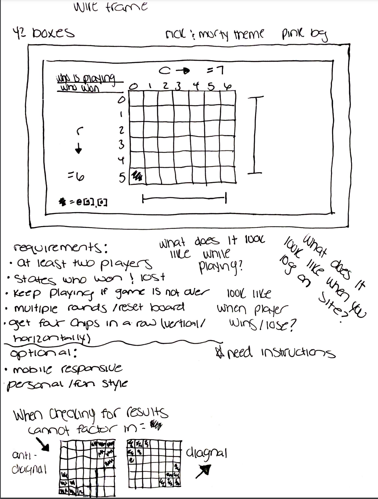

# Connect 4 Game
# WireFrame

# Explanations of specific Technologies 
In order to get the background music for the game I had to download a MP3 file then link it to HTML

# Approach Taken
I was able to watch some creative engineers to get a sense of the code that I needed then I dissected and added what I needed.
I also did a lot of research on websites such as Stack overflow, W3schools, and etc.
I wanted to create a theme for my game and make it flow nicely. 
# Unsolved Problems
Code overriding in certain instances (I believe I would have to go in with "!" to make it stay)
& Grid not being responsive (Just need to add needed code to css)
# Link to Hosted Site
[Link text Here](https://cfowlerx26.github.io/Connect4/)
# Installation Instructions
User can either go on website to play game directly or they will be directed to a link.